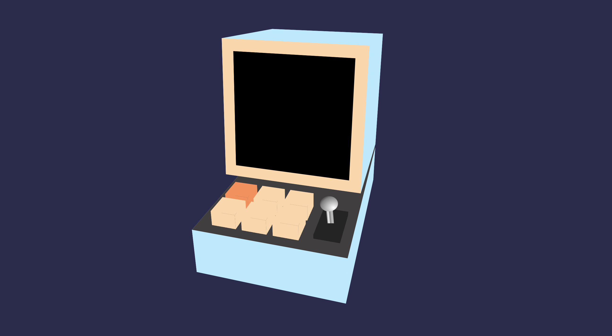

# CSS Divoom Ditoo

Voor het vak CSS to the Rescue van de Web Design & Development heb ik met alleen HTML & CSS een Divoom Ditoo zo goed mogelijk geprobeerd na te maken. Het resultaat kun je [hier](https://inevdhoven.github.io/CSS-Divoom-Ditoo/) bekijken.

_De CSS Divoom Ditoo met het scherm uit_

## De Opdracht

Je kon uit een aantal verschillende opdrachten kiezen waaronder het maken van een modulair bedieningspaneel, waarvoor ik heb gekozen. Toen dacht ik opeens aan een soort mini computertje die ik op Amazon had zien staan en dacht ik dat is leuk om na te proberen te bouwen. Wat ik zo goed mogelijk heb geprobeerd te doen.

## Hoe werkt mijn project?

Je kunt de toetsen en de switch aanklikken met de muis, om het scherm aan te zetten, maar dit kan ook doormiddel van tab, de spatiebalk en pijltjes toetsen. Wanneer je gefocused bent op de eerste radio button kun je met je pijltjes toetsen door de toetsen gaan. Als je daarna dan naar de switch wilt gaan kun je weer op tab klikken. Met de spatiebalk activeer je de toets.

### In welke browsers werkt mijn project?

Mijn project werkt in de volgende browsers:

- Chrome
- Safari
- Firefox behind a flag, omdat ik gebruik maak van de :has() pseudo class en dit is in deze browser nog niet toegevoegd.
- Edge

## Mijn Proces

Mijn hele proces kun je [hier](https://smooth-freeze-4ae.notion.site/CSS-To-The-Rescue-83bc4f197b964d8a98e95837cf69e052) vinden.
